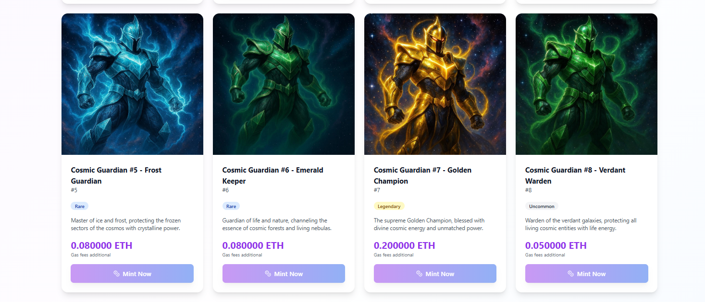

# 🌌 Cosmic Guardians NFT Collection

> A full-stack NFT minting platform featuring legendary cosmic warriors with gasless lazy minting, multi-cryptocurrency payments, and a beautiful modern interface.

[](https://opensource.org/licenses/MIT)
[](https://soliditylang.org/)
[](https://reactjs.org/)
[](https://www.typescriptlang.org/)

---

<div align="center">
  <p align="center">
    <a href="https://cosmic-guardians-nft-kreggscodes-projects.vercel.app/">
      
    </a>
  </p>
  
  <br>
  
  <p align="center">
    <a href="https://cosmic-guardians-nft-kreggscodes-projects.vercel.app/">
      
    </a>
  </p>
  
  <br><br>
  
  <a href="https://cosmic-guardians-nft-kreggscodes-projects.vercel.app/">
    
  </a>
</div>

---

## ✨ Overview

Cosmic Guardians is a premium NFT collection of 15 unique guardian warriors from across the cosmos. Each guardian features unique attributes, rarity levels, and cosmic powers. Built with cutting-edge Web3 technology and designed for seamless user experience.

## 🚀 Features

- ✅ **Gasless Lazy Minting**: Buyers pay gas only when they purchase - zero upfront costs for creators
- ✅ **Multi-Crypto Payments**: Accept ETH, BTC, USDT, USDC, and more
- ✅ **Wallet Integration**: MetaMask, WalletConnect, Coinbase Wallet support
- ✅ **IPFS Storage**: Decentralized storage via Pinata for images and metadata
- ✅ **ERC-721 Standard**: Fully compatible with OpenSea, Rarible, and all major marketplaces
- ✅ **Modern UI**: Beautiful, responsive design with smooth animations
- ✅ **Signature-Based Security**: Cryptographic verification prevents unauthorized minting
- ✅ **Real-time Stats**: Live collection statistics and minting tracker

## Architecture

### Smart Contracts
- **LazyNFT.sol**: ERC-721 contract with lazy minting and signature verification
- **PaymentProcessor.sol**: Handles multi-currency payments and conversions
- Deployed on Ethereum mainnet or Layer 2 (Polygon, Arbitrum for lower fees)

### Backend (Node.js + Express)
- NFT metadata API
- Signature generation for lazy minting
- Payment processing and verification
- IPFS integration (Pinata/NFT.Storage)
- Database for tracking mints and payments

### Frontend (React + TypeScript)
- Wallet connection (Web3Modal)
- NFT gallery and minting interface
- Payment selection (ETH, BTC, stablecoins)
- Transaction status tracking
- User dashboard

## Tech Stack

### Blockchain
- Solidity 0.8.20
- Hardhat (development framework)
- OpenZeppelin contracts
- ethers.js v6

### Backend
- Node.js + Express
- TypeScript
- MongoDB (or PostgreSQL)
- IPFS (Pinata API)
- CoinGecko API (price feeds)

### Frontend
- React 18 + TypeScript
- Vite (build tool)
- TailwindCSS + shadcn/ui
- Web3Modal v3
- wagmi + viem (wallet hooks)
- Lucide React (icons)

## Project Structure

```
nft-project/
├── contracts/              # Smart contracts
│   ├── LazyNFT.sol
│   ├── PaymentProcessor.sol
│   └── test/
├── backend/               # API server
│   ├── src/
│   │   ├── routes/
│   │   ├── controllers/
│   │   ├── services/
│   │   └── utils/
│   ├── package.json
│   └── tsconfig.json
├── frontend/              # React app
│   ├── src/
│   │   ├── components/
│   │   ├── hooks/
│   │   ├── pages/
│   │   └── utils/
│   ├── package.json
│   └── vite.config.ts
├── scripts/               # Deployment scripts
└── README.md
```

## Getting Started

### Prerequisites
- Node.js 18+
- MetaMask or other Web3 wallet
- Infura/Alchemy API key
- Pinata API key (for IPFS)

### Installation

1. **Install dependencies:**
```bash
# Install contract dependencies
cd contracts
npm install

# Install backend dependencies
cd ../backend
npm install

# Install frontend dependencies
cd ../frontend
npm install
```

2. **Configure environment variables:**

Create `.env` files in each directory:

**contracts/.env:**
```
PRIVATE_KEY=your_wallet_private_key
INFURA_API_KEY=your_infura_key
ETHERSCAN_API_KEY=your_etherscan_key
```

**backend/.env:**
```
PORT=3001
MONGODB_URI=mongodb://localhost:27017/nft-project
PINATA_API_KEY=your_pinata_key
PINATA_SECRET_KEY=your_pinata_secret
CONTRACT_ADDRESS=deployed_contract_address
PRIVATE_KEY=your_signing_wallet_key
```

**frontend/.env:**
```
VITE_API_URL=http://localhost:3001
VITE_CONTRACT_ADDRESS=deployed_contract_address
VITE_CHAIN_ID=1
VITE_WALLETCONNECT_PROJECT_ID=your_project_id
```

3. **Deploy contracts:**
```bash
cd contracts
npx hardhat compile
npx hardhat run scripts/deploy.js --network sepolia  # Test on Sepolia first
```

4. **Start backend:**
```bash
cd backend
npm run dev
```

5. **Start frontend:**
```bash
cd frontend
npm run dev
```

## How It Works

### Lazy Minting (Gasless for You)
1. You create NFT metadata and upload images to IPFS
2. Backend generates a cryptographic signature for each NFT
3. Buyer connects wallet and selects NFT
4. Buyer pays (in ETH, BTC, etc.) and pays gas fee
5. Smart contract verifies signature and mints NFT to buyer
6. **You don't pay any gas** - buyer pays everything!

### Multi-Currency Payment Flow
1. User selects payment currency (ETH, BTC, USDT, etc.)
2. Backend calculates equivalent amount using live price feeds
3. For ETH/ERC-20: Direct smart contract payment
4. For BTC: Payment gateway integration (BTCPay Server or similar)
5. After payment confirmation, NFT is minted

### Payment Options

#### Option 1: ETH/ERC-20 Only (Simplest)
- Direct smart contract payments
- Instant minting
- No additional infrastructure needed

#### Option 2: Multi-Crypto with Payment Gateway
- Integrate BTCPay Server (self-hosted, no fees)
- Or use NOWPayments, CoinPayments (small fees)
- Backend monitors payment status
- Mints NFT after confirmation

## Deployment

### Recommended Networks

1. **Ethereum Mainnet**: Most expensive, highest security
2. **Polygon**: Very low fees (~$0.01), fast
3. **Arbitrum/Optimism**: Low fees, Ethereum security
4. **Base**: Coinbase's L2, growing ecosystem

### Cost Breakdown

**Your Costs:**
- Contract deployment: $50-200 (one-time, on Polygon ~$1)
- IPFS storage: Free tier available (Pinata, NFT.Storage)
- Server hosting: $5-20/month (DigitalOcean, Railway)

**Buyer Costs:**
- Gas fee: $5-50 on Ethereum, $0.01-1 on Polygon
- NFT price: Whatever you set

## Security Considerations

- ✅ Signature verification prevents unauthorized minting
- ✅ Reentrancy guards on payment functions
- ✅ Rate limiting on API endpoints
- ✅ Private key management (use environment variables)
- ✅ Input validation and sanitization

## Testing

```bash
# Test contracts
cd contracts
npx hardhat test

# Test backend
cd backend
npm test

# Test frontend
cd frontend
npm test
```

## 🚢 Deployment Guide

### Backend Deployment (Recommended: Railway/Render)

**Railway.app** (Recommended - Free tier available):
1. Connect your GitHub repository
2. Add environment variables from `.env.example`
3. Deploy automatically on push

**Render.com**:
1. Create new Web Service
2. Connect repository
3. Build command: `cd backend && npm install && npm run build`
4. Start command: `cd backend && npm start`

### Frontend Deployment (Recommended: Vercel/Netlify)

**Vercel** (Recommended - Best for React):
```bash
cd frontend
npm install -g vercel
vercel
```

**Netlify**:
1. Connect GitHub repository
2. Build command: `cd frontend && npm run build`
3. Publish directory: `frontend/dist`

### Smart Contract Deployment

**Sepolia Testnet** (Free testing):
```bash
cd contracts
npx hardhat run scripts/deploy.js --network sepolia
```

**Polygon Mainnet** (Low cost ~$1):
```bash
npx hardhat run scripts/deploy.js --network polygon
```

### Cost Breakdown

**Total Setup Cost: $0-10**
- Contract deployment: $0 (testnet) or ~$1 (Polygon)
- Backend hosting: Free tier (Railway/Render)
- Frontend hosting: Free (Vercel/Netlify)
- IPFS storage: Free tier (Pinata)

**Monthly Costs: $0**
- All services have generous free tiers
- Upgrade only if you get significant traffic

## 📚 Documentation

Detailed guides available in the `/docs` folder:
- `QUICK_START.md` - Get started in 5 minutes
- `DEPLOYMENT_GUIDE.md` - Step-by-step deployment
- `BLOCKCHAIN_GUIDE.md` - Understanding the smart contracts
- `SETUP_YOUR_ENV.md` - Environment configuration

## 🤝 Contributing

Contributions are welcome! Please feel free to submit a Pull Request.

## 📄 License

MIT License - feel free to use this project for your own NFT collection!

## 🔗 Resources

- [OpenZeppelin Contracts](https://docs.openzeppelin.com)
- [Hardhat Documentation](https://hardhat.org/docs)
- [Web3Modal Documentation](https://docs.walletconnect.com/web3modal)
- [Pinata IPFS](https://www.pinata.cloud/)

## ⚠️ Security

**NEVER commit your private keys or API secrets!**

Always use `.env` files and add them to `.gitignore`. The `.env.example` files show what variables you need without exposing actual values.

---

Built with ❤️ for the Web3 community
