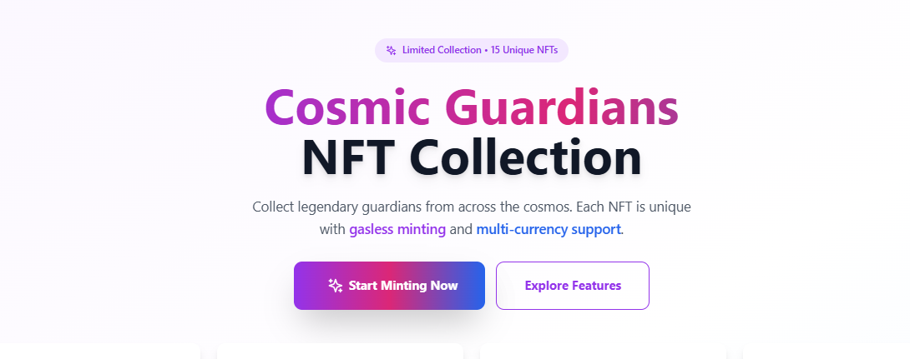

# 🌌 Cosmic Guardians NFT Collection

> A full-stack NFT minting platform featuring legendary cosmic warriors with gasless lazy minting, multi-cryptocurrency payments, and a beautiful modern interface.

[](https://opensource.org/licenses/MIT)
[](https://soliditylang.org/)
[](https://reactjs.org/)
[](https://www.typescriptlang.org/)

---

<div align="center">

## 🌟 **🚀 LIVE WEBSITE - VISIT NOW! 🚀**

<a href="https://cosmic-guardians-nft-kreggscodes-projects.vercel.app/">
  
</a>

### **👀 SEE THE COSMIC GUARDIANS NFT PLATFORM IN ACTION! 👀**

<a href="https://cosmic-guardians-nft-kreggscodes-projects.vercel.app/">
  
</a>

---

  <p align="center">
    
  </p>

  <br>

  <p align="center">
    
  </p>

  <br><br>
</div>

---

## ✨ Overview

Cosmic Guardians is a premium NFT collection of 15 unique guardian warriors from across the cosmos. Each guardian features unique attributes, rarity levels, and cosmic powers. Built with cutting-edge Web3 technology and designed for seamless user experience.

## 🚀 Features

- ✅ **Gasless Lazy Minting**: Buyers pay gas only when they purchase - zero upfront costs for creators
- ✅ **Multi-Crypto Payments**: Accept ETH, BTC, USDT, USDC, and more
- ✅ **Wallet Integration**: MetaMask, WalletConnect, Coinbase Wallet support
- ✅ **IPFS Storage**: Decentralized storage via Pinata for images and metadata
- ✅ **ERC-721 Standard**: Fully compatible with OpenSea, Rarible, and all major marketplaces
- ✅ **Modern UI**: Beautiful, responsive design with smooth animations
- ✅ **Signature-Based Security**: Cryptographic verification prevents unauthorized minting
- ✅ **Real-time Stats**: Live collection statistics and minting tracker

## Architecture

### Smart Contracts
- **LazyNFT.sol**: ERC-721 contract with lazy minting and signature verification
- **PaymentProcessor.sol**: Handles multi-currency payments and conversions
- Deployed on Ethereum mainnet or Layer 2 (Polygon, Arbitrum for lower fees)

### Backend (Node.js + Express)
- NFT metadata API
- Signature generation for lazy minting
- Payment processing and verification
- IPFS integration (Pinata/NFT.Storage)
- Database for tracking mints and payments

### Frontend (React + TypeScript)
- Wallet connection (Web3Modal)
- NFT gallery and minting interface
- Payment selection (ETH, BTC, stablecoins)
- Transaction status tracking
- User dashboard

## Tech Stack

### Blockchain
- Solidity 0.8.20
- Hardhat (development framework)
- OpenZeppelin contracts
- ethers.js v6

### Backend
- Node.js + Express
- TypeScript
- MongoDB (or PostgreSQL)
- IPFS (Pinata API)
- CoinGecko API (price feeds)

### Frontend
- React 18 + TypeScript
- Vite (build tool)
- TailwindCSS + shadcn/ui
- Web3Modal v3
- wagmi + viem (wallet hooks)
- Lucide React (icons)

## Project Structure

```
nft-project/
├── contracts/              # Smart contracts
│   ├── LazyNFT.sol
│   ├── PaymentProcessor.sol
│   └── test/
├── backend/               # API server
│   ├── src/
│   │   ├── routes/
│   │   ├── controllers/
│   │   ├── services/
│   │   └── utils/
│   ├── package.json
│   └── tsconfig.json
├── frontend/              # React app
│   ├── src/
│   │   ├── components/
│   │   ├── hooks/
│   │   ├── pages/
│   │   └── utils/
│   ├── package.json
│   └── vite.config.ts
├── scripts/               # Deployment scripts
└── README.md
```

## 🚀 Quick Start

### Prerequisites
- **Node.js 18+** - [Download here](https://nodejs.org/)
- **MetaMask or other Web3 wallet** - [Install MetaMask](https://metamask.io/)
- **Git** - [Download here](https://git-scm.com/)
- **Code editor** - VS Code recommended

### 📋 Step-by-Step Setup

#### 1. **Clone and Install Dependencies**

```bash
# Clone the repository
git clone https://github.com/your-username/cosmic-guardians-nft.git
cd cosmic-guardians-nft

# Install all dependencies (contracts, backend, frontend)
npm run install:all
```

#### 2. **Get Required API Keys**

You'll need these free API keys:

| Service | Website | Purpose |
|---------|---------|---------|
| **Infura** | [infura.io](https://infura.io) | Blockchain RPC access |
| **Pinata** | [pinata.cloud](https://pinata.cloud) | IPFS storage for NFTs |
| **Etherscan** | [etherscan.io](https://etherscan.io) | Contract verification |
| **WalletConnect** | [cloud.walletconnect.com](https://cloud.walletconnect.com) | Wallet connection |

#### 3. **Configure Environment Variables**

Create `.env` files in each directory:

**contracts/.env:**
```env
PRIVATE_KEY=your_metamask_private_key_here
INFURA_API_KEY=your_infura_project_id
ETHERSCAN_API_KEY=your_etherscan_api_key
POLYGONSCAN_API_KEY=your_polygonscan_api_key
```

**backend/.env:**
```env
PORT=3001
NODE_ENV=development
MONGODB_URI=mongodb://localhost:27017/nft-project
CONTRACT_ADDRESS=0x0000000000000000000000000000000000000000
CHAIN_ID=11155111
RPC_URL=https://sepolia.infura.io/v3/YOUR_INFURA_KEY
PRIVATE_KEY=your_metamask_private_key_here
PINATA_API_KEY=your_pinata_api_key
PINATA_SECRET_KEY=your_pinata_secret_key
JWT_SECRET=your_jwt_secret_key_here
RATE_LIMIT_WINDOW_MS=900000
RATE_LIMIT_MAX_REQUESTS=100
```

**frontend/.env:**
```env
VITE_API_URL=http://localhost:3001
VITE_CONTRACT_ADDRESS=0x0000000000000000000000000000000000000000
VITE_CHAIN_ID=11155111
VITE_WALLETCONNECT_PROJECT_ID=your_walletconnect_project_id
```

#### 4. **How to Get Your MetaMask Private Key**

⚠️ **WARNING: Never share your private key with anyone!**

1. Open MetaMask extension
2. Click the three dots (⋮) in top right
3. Click "Account details"
4. Click "Show private key"
5. Enter your MetaMask password
6. Copy the private key
7. Paste it in both `contracts/.env` and `backend/.env`

#### 5. **Deploy Smart Contracts**

```bash
# Test deployment on Sepolia (free)
cd contracts
npx hardhat compile
npx hardhat run scripts/deploy.js --network sepolia

# Copy the deployed contract address to your .env files
```

#### 6. **Start the Development Servers**

```bash
# Start backend server (Terminal 1)
cd backend
npm run dev

# Start frontend server (Terminal 2)
cd frontend
npm run dev
```

#### 7. **Access Your App**

- **Frontend:** http://localhost:5173
- **Backend API:** http://localhost:3001
- **MetaMask Network:** Make sure you're on Sepolia testnet!

### 🎯 What You Should See

After completing setup:
- ✅ Frontend loads at http://localhost:5173
- ✅ 15 Cosmic Guardian NFTs displayed
- ✅ Wallet connection works
- ✅ Backend API responds at http://localhost:3001

## How It Works

### Lazy Minting (Gasless for You)
1. You create NFT metadata and upload images to IPFS
2. Backend generates a cryptographic signature for each NFT
3. Buyer connects wallet and selects NFT
4. Buyer pays (in ETH, BTC, etc.) and pays gas fee
5. Smart contract verifies signature and mints NFT to buyer
6. **You don't pay any gas** - buyer pays everything!

### Multi-Currency Payment Flow
1. User selects payment currency (ETH, BTC, USDT, etc.)
2. Backend calculates equivalent amount using live price feeds
3. For ETH/ERC-20: Direct smart contract payment
4. For BTC: Payment gateway integration (BTCPay Server or similar)
5. After payment confirmation, NFT is minted

### Payment Options

#### Option 1: ETH/ERC-20 Only (Simplest)
- Direct smart contract payments
- Instant minting
- No additional infrastructure needed

#### Option 2: Multi-Crypto with Payment Gateway
- Integrate BTCPay Server (self-hosted, no fees)
- Or use NOWPayments, CoinPayments (small fees)
- Backend monitors payment status
- Mints NFT after confirmation

## Deployment

### Recommended Networks

1. **Ethereum Mainnet**: Most expensive, highest security
2. **Polygon**: Very low fees (~$0.01), fast
3. **Arbitrum/Optimism**: Low fees, Ethereum security
4. **Base**: Coinbase's L2, growing ecosystem

### Cost Breakdown

**Your Costs:**
- Contract deployment: $50-200 (one-time, on Polygon ~$1)
- IPFS storage: Free tier available (Pinata, NFT.Storage)
- Server hosting: $5-20/month (DigitalOcean, Railway)

**Buyer Costs:**
- Gas fee: $5-50 on Ethereum, $0.01-1 on Polygon
- NFT price: Whatever you set

## Security Considerations

- ✅ Signature verification prevents unauthorized minting
- ✅ Reentrancy guards on payment functions
- ✅ Rate limiting on API endpoints
- ✅ Private key management (use environment variables)
- ✅ Input validation and sanitization

## Testing

```bash
# Test contracts
cd contracts
npx hardhat test

# Test backend
cd backend
npm test

# Test frontend
cd frontend
npm test
```

## 🚢 Deployment Guide

### Backend Deployment (Recommended: Railway/Render)

**Railway.app** (Recommended - Free tier available):
1. Connect your GitHub repository
2. Add environment variables from `.env.example`
3. Deploy automatically on push

**Render.com**:
1. Create new Web Service
2. Connect repository
3. Build command: `cd backend && npm install && npm run build`
4. Start command: `cd backend && npm start`

### Frontend Deployment (Recommended: Vercel/Netlify)

**Vercel** (Recommended - Best for React):
```bash
cd frontend
npm install -g vercel
vercel
```

**Netlify**:
1. Connect GitHub repository
2. Build command: `cd frontend && npm run build`
3. Publish directory: `frontend/dist`

### Smart Contract Deployment

**Sepolia Testnet** (Free testing):
```bash
cd contracts
npx hardhat run scripts/deploy.js --network sepolia
```

**Polygon Mainnet** (Low cost ~$1):
```bash
npx hardhat run scripts/deploy.js --network polygon
```

### Cost Breakdown

**Total Setup Cost: $0-10**
- Contract deployment: $0 (testnet) or ~$1 (Polygon)
- Backend hosting: Free tier (Railway/Render)
- Frontend hosting: Free (Vercel/Netlify)
- IPFS storage: Free tier (Pinata)

**Monthly Costs: $0**
- All services have generous free tiers
- Upgrade only if you get significant traffic

## 📚 Documentation

- `BLOCKCHAIN_GUIDE.md` - Understanding the smart contracts and Web3 concepts
- **API Documentation** - Available at `http://localhost:3001/api/docs` when backend is running

## 🤝 Contributing

Contributions are welcome! Please feel free to submit a Pull Request.

## 📄 License

MIT License - feel free to use this project for your own NFT collection!

## 🔗 Resources

- [OpenZeppelin Contracts](https://docs.openzeppelin.com)
- [Hardhat Documentation](https://hardhat.org/docs)
- [Web3Modal Documentation](https://docs.walletconnect.com/web3modal)
- [Pinata IPFS](https://www.pinata.cloud/)

## 🛠️ Troubleshooting

### Common Issues

#### Backend won't start
```bash
# Check if port 3001 is available
netstat -ano | findstr :3001

# Kill process if needed (replace PID)
taskkill /PID <PID> /F

# Clear cache and reinstall
cd backend
rm -rf node_modules package-lock.json
npm install
npm run dev
```

#### MetaMask connection issues
- Ensure you're on Sepolia testnet
- Check if contract address is correct in `.env`
- Verify RPC URL in MetaMask matches your Infura endpoint

#### Contract deployment fails
```bash
# Check your private key format (should start with 0x)
# Verify Infura API key is correct
# Ensure you have Sepolia ETH for gas fees
```

#### NFTs not loading
- Check backend is running on port 3001
- Verify IPFS images are accessible
- Check browser console for errors

### Need Help?

1. Check the browser console for errors
2. Verify all `.env` files are configured correctly
3. Ensure MetaMask is on the correct network
4. Check backend logs for API errors

## ⚠️ Security & Best Practices

### 🚫 NEVER Commit These Files
- `.env` files (anywhere in the project)
- Private keys or API secrets
- `minted-nfts.json`
- Any file containing sensitive information

### ✅ Always Use Environment Variables
- Store all secrets in `.env` files
- Use `.env.example` files to show required variables
- Add `.env*` to `.gitignore`

### 🔐 Private Key Management
- **Never** use your main MetaMask wallet for development
- Create separate wallets for testing and production
- Use environment variables, never hardcode keys
- Rotate keys regularly in production

### 🛡️ Additional Security
- Rate limiting is enabled on API endpoints
- Input validation on all forms
- Signature verification prevents unauthorized minting
- Reentrancy guards on smart contract functions

---

## 📞 Support

If you encounter issues:

1. **Check this README** - Most common issues are covered above
2. **Browser Console** - Look for JavaScript errors
3. **Backend Logs** - Check terminal output for API errors
4. **Network Issues** - Verify MetaMask network settings

Built with ❤️ for the Web3 community
